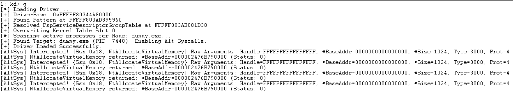

### Bypassing KPP on Windows 11 25H2

**An alternative way for SSDT hooking that bypasses KPP (Kernel Patch Protection/PatchGuard).** Traditional SSDT hooking is a suicide mission on modern Windows because PatchGuard obsessively monitors the `KeServiceDescriptorTable`. Instead of fighting the kernel, we play by its rules. We use the **System Call Provider** infrastructure which is a legitimate framework designed for subsystems like WSL or Pico to route syscalls through our own custom dispatch logic.

---

### Understanding the Structures

To hijack the flow, we have to populate a specific set of undocumented structures that the kernel uses to identify "Alternative" providers.

- **The Group Table:** A global array of 32 "Slots." We find an empty one and claim it as our own.
    
- **The Dispatch Context:** A small struct we write into the `_EPROCESS` (typically at offset `0x7D0`) that tells the kernel, "Hey, this process belongs to Slot X".
    
- **The Dispatch Table:** This is our custom SSDT. It contains a `max_ssn` and an array of RVAs (Relative Virtual Addresses) that point to our hook functions.

``` C
typedef struct {
    UINT32 Level; // Priority
    UINT32 Slot;  // Index into the Group Table
} PspSyscallProviderDispatchContext;

typedef struct {
    UINT32 max_ssn;
    UINT32 ssn_entry_rva[1]; // Encoded as (Offset << 4) | Flags
} ssn_dispatch_table;
```

To understand why you're stripping the lower bits, you have to look at how the Windows Kernel (specifically `nt!PsSyscallProviderDispatch`) treats the values you put into your **Alternative SSDT** (`ssn_entry_rva`). It isn't just a list of pointers; it’s a packed bitfield that controls the entire dispatch pipeline.

### The Bitfield Encoding

Each entry in your `ssn_dispatch_table` is encoded using the following logic:

**`Value = (RVA << 4) | Flags`**

When the kernel pulls this value during a syscall, it uses the lower 4 bits to decide which path of the pipeline to take.

### The Pipeline Flow

#### 1. The Entry Point

When a thread with the `0x20` bit set in `DebugActive` triggers a syscall, the kernel diverts from the standard path and calls `nt!PsSyscallProviderDispatch`. It uses the `Slot` in your `EPROCESS` (Offset `0x7D4`) to find your row in the `PspServiceDescriptorGroupTable`.

#### 2. The Branching Logic (The "Flags")

The kernel looks at the bottom nibble (0–3 bits) of your entry to choose between two distinct internal engines:

- **The Fast Path (Bit 4 / `0x10` is NOT set):** The kernel calls `PspSyscallProviderServiceDispatch`. This is a "raw" jump to your handler. It's fast, but it **does not capture stack arguments**. If you're hooking a syscall with more than 4 arguments, your handler will likely read garbage from the stack or crash.
    
- **The Generic Path (Bit 4 / `0x10` IS set):** The kernel calls `PspSyscallProviderServiceDispatchGeneric`. This is the "safe" route. The kernel uses the remaining lower bits to determine a **QWORD count** for argument copying. It captures the user-mode stack arguments and places them into a clean buffer for your handler.

#### 3. The Address Reconstruction

Once the path is chosen, the kernel has to find where your code actually lives. Since you provided an **RVA**, it performs the following math:

1. **Shift Right**: It shifts your value right by 4 to remove the flags and recover the raw RVA.
    
2. **Add Base**: It adds this RVA to the `DriverBase` pointer stored in your `PspServiceDescriptorRow`.
    
3. **The Call**: It finally jumps to that absolute address, passing the captured arguments to your `AltSyscallHandler`.
    

Once the kernel completes the address reconstruction and clears the flag bits, it enters the final stage of the **AltSyscall Pipeline** This is where the transition from "Kernel Logic" to "Your Logic" happens.

### 4. The Invocation (The Hook in Action)

After the kernel has calculated the absolute address of your handler and prepared the argument buffer (in the Generic Path), it performs a `CALL` to your driver.

- **Context Passing**: The kernel doesn't just jump to your code; it passes a `CONTEXT` structure or a set of registers that contain the original user-mode state. This includes the original SSN, the return address, and the pointers to the parameters.
    
- **Execution Isolation**: Your handler now runs with full kernel privileges (`CPL 0`). Because you are in the "Generic" pipeline, the kernel has already stabilized the stack for you. You can read or even **modify** the arguments before they are ever passed to the original function.

### 5. The Decision Point (Handle or Pass)

Your handler's return value determines what the kernel does next. This is the "Fork in the Road":

- **Return TRUE (Handled)**: You tell the kernel, "I’ve got this." The kernel skips the original SSDT function entirely. It takes the result you placed in `RAX` and begins the `sysret` process to return to user-mode. This is how you "block" or "spoof" a syscall like `NtQuerySystemInformation`.
    
- **Return FALSE (Pass-Through)**: You tell the kernel, "I just wanted to watch." After your code finishes logging the activity, the kernel continues the original execution flow, eventually calling the real function in the `KeServiceDescriptorTable`.

### 6. Implementation: Hooking NtAllocateVirtualMemory

When hooking NtAllocateVirtualMemory via the Alternative Syscall Provider, there are two major hurdles: Register Limits and Address Retrieval.

When we hook NtAllocateVirtualMemory, we want to log the parameters and the resulting allocated address. However, we face two main challenges:
1. If the user didn't request to allocate memory in a specific address (i.e., BaseAddress is NULL), we won't know the actual allocated address until after the original function executes.
2. ArgStack (the raw registers) only captures the first 4 parameters.

The Solution:
1. You'll notice in the code that we don't just return a value, we manually call originalNtAllocFuntion. This is because our hook is an interceptor, not a replacement for the entire memory manager. We ofc don't want to write our own physical memory allocator we just want to watch/modify the request.
2. To get Arg5 (AllocationType) and Arg6 (Protect), we have to manually walk the user-mode stack. To do this we find the UserRsp at P3Home + 0x170 and pull the remaining arguments directly from the caller's stack memory.

The BaseAddress parameter is a pointer (PVOID*). When the syscall starts, the value at that pointer is 0 (or a requested hint). The actual allocated address only exists after the original NT function executes.

The "Post-Hook" Check: We call the original function, wait for it to return, and then we read the BaseAddress pointer again. This is how we log the exact memory address that Windows allocated to the process.
``` C++
// 1. Call original to let Windows do the allocation
NTSTATUS status = originalNtAllocFuntion(...);

// 2. NOW we can see where the memory was actually placed
__try {
    AllocatedAddress = *pBaseAddress; 
} __except (1) {}

// 3. Manually fix RAX so the user-mode app gets the correct NTSTATUS
UINT64* pRax = (UINT64*)((UINT64)P3Home + 0x78);
*pRax = (UINT64)status;
```

### Execution of out callback
We can load the driver into kernel space using `sc.exe` or kernel loaders like `Kd-mapper/KDU`, For this PoC im going to enable Test-Signing and use `sc.exe` to load the driver. 
Note: The dummy application must already be running before loading the driver, because the provider is assigned to a target process at load time. If the target process isn't running, the provider won't be able to hook into it.
Once the driver is loaded, we can use a out user-mode application (`dummy.exe`) to trigger the syscall we hooked (`NtAllocateVirtualMemory` in this case).
When the driver is loaded and the provider is assigned to a target process (`dummy.exe`), we can observe the redirection in real-time. Below is the debug output showing the interception of `NtAllocateVirtualMemory` with the raw arguments and the return status:
